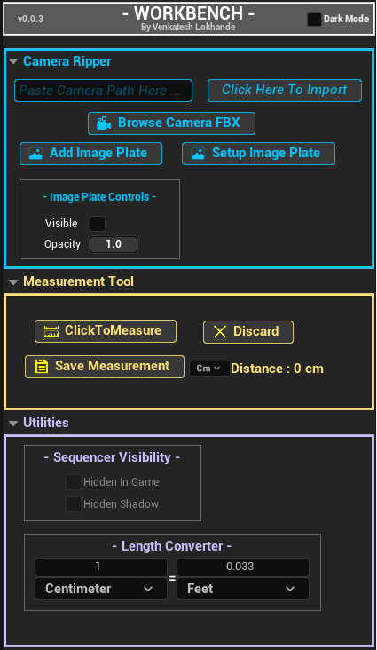
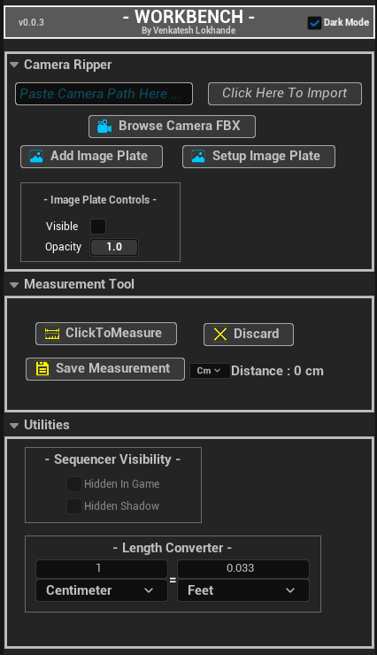
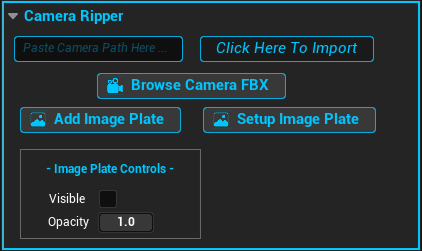
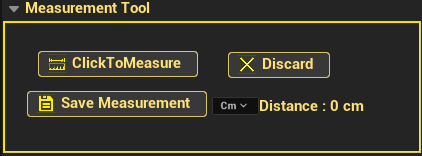
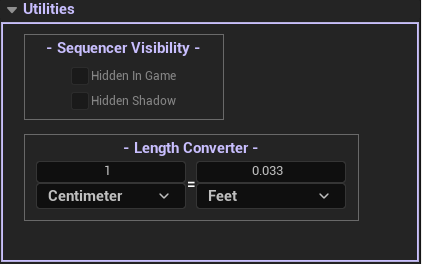

# WORKBENCH

Workbench is a collection of workflow tools that automate everyday tasks for artists.

<table>
<tr>

<td align="center" width="50%">
<b>Light Mode</b>  

</td>

<td align="center" width="50%">
<b>Dark Mode</b>  

</td>

</tr>
</table>

## Supported Unreal Engine Versions

-  Unreal Engine 5.6.1
-  For UE 5.8 https://www.fab.com/listings/ea98f6d6-261e-45d5-b200-17f8281b178b
-  Tutorial link: https://www.youtube.com/playlist?list=PLfyloWiRsXog

---

## Featured Tools
                                                      Camera Ripper
                                  "A streamlined camera import workflow for Unreal Engine"

<table>
<tr>
<td width="50%" valign="top">

 ### "Browse Camera FBX" "Click Here To Import"
- Batch import FBX cameras directly into Sequencer
- Automatically creates the shot folder and Level Sequence
- Automatically creates Image Plate and Media Player assets
- One-click Image Plate setup
- Built-in Image Plate opacity and visibility controls.
  

**Requirements, in order:**
1. Select the destination folder in the Content Browser first.
2. The camera inside the FBX must have the same name as the FBX file
3. Camera FBX files should follow a versioned naming convention (e.g. SH010_001_v001.fbx).
-  Example Below
-  FBX Name : SH010_001_v001.fbx
-  Folder Name Becomes : SH010_001
-  Sequence Name Becomes : SH010_001_v001

### Setup Image Plate

Configures full media playback on a camera's Image Plate — creates the Media Source,
Media Player, Media Texture, Material, and Material Instance, and wires them together
automatically, then adds a Media Track to the currently open sequence.

**Requirements, in order:**
1. A Level Sequence must be open in Sequencer.
2. The target camera must be selected in the viewport (only the first selected actor is used).
3. **"Add Image Plate" must be run on that camera first** — Setup Image Plate will
   fail with a clear error if no Image Plate component exists yet.
4. Your video file must be in **.mov** format (other formats aren't currently supported).

**Notes:**
- Re-running this on the same sequence reuses and updates existing generated assets
  rather than creating duplicates.
- Re-running this **resets any manual edits** made to the generated material — it
  fully rebuilds the material graph from scratch each time.
- The Media Track's range is automatically matched to the sequence's playback range.

</td>

<td width="50%" align="center">

</td>
</tr>
</table>

                                                     Measurement Tool
                                   "Measure distances directly inside the Unreal Editor"

                                   
<table>
<tr>

<td width="50%" valign="top">

  Key Features

- Click anywhere in the viewport to measure distance
- Live measurement preview
- Save measurements directly into the level
- Supports converting from Centimeter, Meter and Feet units

</td>

<td width="50%" align="center">

</td>

</tr>
</table>

                                                        Utilities
                             "Everyday workflow utilities for faster scene management"

<table>
<tr>

<td width="50%" valign="top">

### Key Features

- Quickly Toggle visibility for selected actors in Sequencer 
- Built-in Length Converter with multiple unit support
- Designed to speed up repetitive editor tasks

</td>

<td width="50%" align="center">

</td>

</tr>
</table>
## Installation

1. Download the latest Release.
2. Extract the ZIP.
3. Copy the **Workbench** folder into your project's **Plugins** folder.
4. Restart Unreal Engine.
5. Launch Workbench by clicking the **Workbench** button in the Unreal Engine toolbar.

  

---

## Roadmap

- Techviz Tools
- Material Library
- PCG Library
- Additional Utilities

---

## License

MIT License

---

## Author

Venkatesh Lokhande
